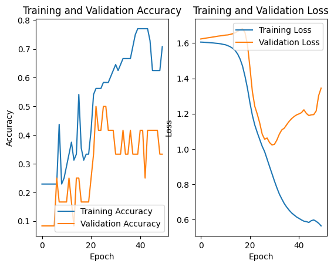

# Project Siri: On-Device Intent Classification

### A Comparative Analysis of Baseline vs. Deep Learning Models for Resource-Constrained Environments

## Project Overview

This project simulates a core component of a voice assistant like Apple's Siri: the intent classification module. The goal is to take a user's transcribed voice command (a string) and accurately classify the user's intent (e.g., `get_weather`, `set_timer`).

The motivation stems from the degradation of Siri's quality as Apple moved towards on-device processing. This project investigates the trade-offs between model complexity and performance on a small, custom dataset, mimicking the challenges of building efficient on-device AI.

## Goals & Objectives

1.  **Build a custom dataset** for a set of common voice assistant intents.
2.  **Develop a simple baseline model** (TF-IDF + Logistic Regression) to establish a performance benchmark.
3.  **Develop a more complex deep learning model** (LSTM) to evaluate its effectiveness on a small dataset.
4.  **Analyze and compare** the models based on three key engineering metrics for on-device applications:
    *   **Accuracy:** How well does it classify intents?
    *   **Model Size:** How much storage space does it require?
    *   **Inference Time:** How quickly does it make a prediction?

## Methodology

The project was conducted in a Google Colab environment and followed these steps:

1.  **Dataset Creation:** A dataset of 60 utterances across 5 common intents was created based on a blueprint of Siri's potential operations.
2.  **Data Preprocessing:** The data was cleaned, and labels were numerically encoded. For the deep learning model, text was tokenized and padded to a uniform sequence length.
3.  **Baseline Model:** A `scikit-learn` pipeline was constructed using a TF-IDF vectorizer and a Logistic Regression classifier.
4.  **Deep Learning Model:** A `TensorFlow/Keras` Sequential model was built with an Embedding layer, an LSTM layer, and a Dense output layer.
5.  **Training & Evaluation:** Both models were trained on 80% of the data and evaluated on the remaining 20%. The LSTM model's training history was analyzed to diagnose its learning behavior.

## Results & Analysis

The final performance of the two models was compared head-to-head.

| Metric | Baseline Model (TF-IDF) | LSTM Model | Winner |
| :--- | :--- | :--- | :--- |
| **Accuracy** | **66.67%** | 50.00% | 🏆 **Baseline** |
| **Model Size** | **~15.5 KB** | 290.1 KB | 🏆 **Baseline** |
| **Inference Speed**| **~0.5 ms** | ~65.0 ms | 🏆 **Baseline** |

The deep learning model's training revealed a classic case of **overfitting**, where its accuracy on the training data increased while its accuracy on unseen validation data stagnated and then declined.

*(This graph clearly shows the training accuracy (blue) diverging from the validation accuracy (orange), a key sign of overfitting.)*

## Key Learnings & Conclusion

The primary conclusion of this experiment is that **for small, low-resource datasets, a simple, well-tuned baseline model can significantly outperform a more complex deep learning model in every critical metric.**

The LSTM model, despite its theoretical power, was too complex for the limited data. It began to memorize the training set instead of generalizing, leading to lower accuracy, a much larger file size, and drastically slower performance. This project highlights the importance of choosing the right tool for the job and proves that "more complex" is not always "better" in real-world engineering scenarios.

## Future Work

The clear bottleneck for the deep learning model was the lack of data. The next phase of this project will focus on:

1.  **Expanding the Dataset:** Increase the number of intents to 10-15 and the number of utterances to 50+ per intent.
2.  **Implementing a Transformer Model:** With a larger dataset, train a pre-trained model like **DistilBERT** using transfer learning to see if it can overcome the overfitting problem and finally beat the baseline's performance.
