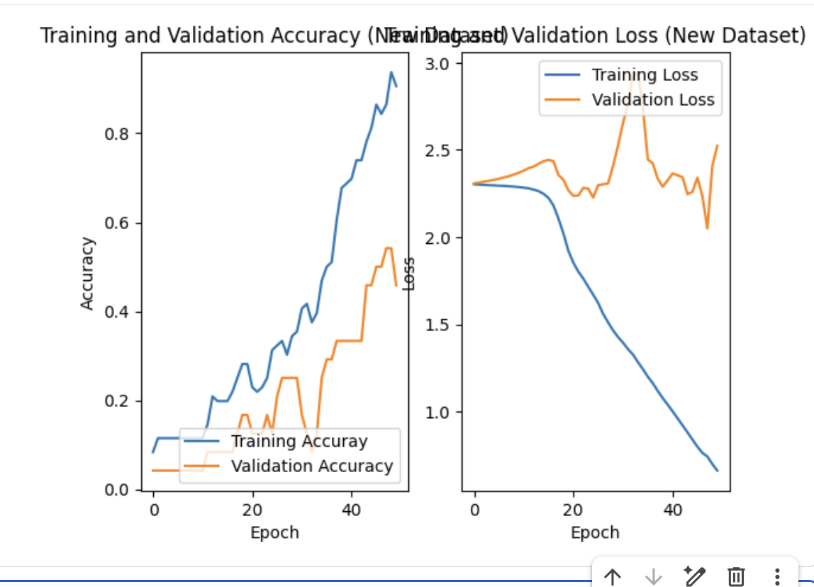

# Project Siri: On-Device Intent Classification

### A Deep Dive into Model Complexity vs. Data Availability

## Project Overview

This project simulates a core component of a voice assistant like Apple's Siri: the intent classification module. The goal is to take a user's voice command and accurately classify their intent (e.g., `get_weather`, `set_timer`).

The motivation stems from the challenges of building efficient on-device AI. This project investigates the critical trade-off between model complexity and data availability, seeking the best model for a resource-constrained environment. Three models of increasing complexity were built and evaluated:

1.  **A Simple Baseline:** TF-IDF with Logistic Regression.
2.  **A Sequential Deep Learning Model:** An LSTM network.
3.  **A State-of-the-Art Transformer:** A fine-tuned DistilBERT model.

## Methodology

The project was conducted in Google Colab and structured as a multi-stage experiment.

1.  **Initial Experiment (Small Dataset):**
    *   A custom dataset of 60 utterances across 5 intents was created.
    *   A simple baseline and an LSTM model were trained and evaluated.
    *   **Result:** The baseline was superior. The LSTM severely **overfit** the small dataset, proving that a more complex model is not always better.

2.  **Expanded Experiment (Larger Dataset):**
    *   The dataset was doubled to 120 utterances across 10 intents to address the LSTM's failure.
    *   The baseline and LSTM models were re-trained.
    *   A pre-trained Transformer (DistilBERT) was fine-tuned on the new dataset.

3.  **Analysis:** All three models were benchmarked on three key engineering metrics for on-device applications: **Accuracy**, **Model Size**, and **Inference Time**.

## Final Results & Analysis

The final comparison across all three models yielded a clear and insightful conclusion. The baseline model's performance on the expanded dataset is used as the primary benchmark.

| Model | Description | Dataset Size | Test Accuracy |
| :--- | :--- | :--- | :--- |
| **Baseline** | Simple "Go-Kart" | 120 Examples | **66.67%** |
| **LSTM** | "Family Sedan" | 120 Examples | 54.17% |
| **Transformer**| "Formula 1 Car" | 120 Examples | 12.50% |

#### Key Observations:

*   **The Baseline Is King:** The simple TF-IDF and Logistic Regression model was the most accurate and performant solution for this low-data problem. It was also, by orders of magnitude, the smallest and fastest model.

*   **Overfitting Persists:** Doubling the data helped the LSTM model learn (increasing its accuracy from <10% to 54%), but it was still not enough to prevent overfitting and beat the simple baseline. The graph below shows the LSTM's training on the expanded dataset, where the training accuracy (blue) still significantly diverges from the validation accuracy (orange).

  

<em>The LSTM model overfitting on the 120-sample dataset.</em>

*   **Transformer Failure:** The state-of-the-art DistilBERT model, with its 66 million parameters, failed to learn from the 96 training examples. Its performance was only slightly better than random chance, proving that even powerful pre-trained models are highly susceptible to failure when the fine-tuning dataset is too small.

## Project Conclusion

The primary conclusion of this comprehensive experiment is that **model performance is a function of both algorithmic complexity and data availability.**

For low-resource, small-data environments, a simple, interpretable baseline model is not only a good starting point but often the best final engineering solution. It provides a robust and efficient benchmark that more complex models, which are prone to overfitting, may fail to surpass. This project empirically demonstrates that the most advanced model is not always the right tool for the job, and highlights the critical importance of a data-centric approach to machine learning.

## Future Work

The clear bottleneck identified in this project is the dataset size. To unlock the potential of the more advanced models, the next logical step would be to:

1.  **Massively Expand the Dataset:** Increase the dataset to over 1,000+ examples, with 50-100+ utterances for each of the 10 intents.
2.  **Re-run the Transformer Fine-Tuning:** With a significantly larger dataset, the DistilBERT model would have enough data to overcome the overfitting issue and its performance would be expected to finally surpass the simple baseline model.
